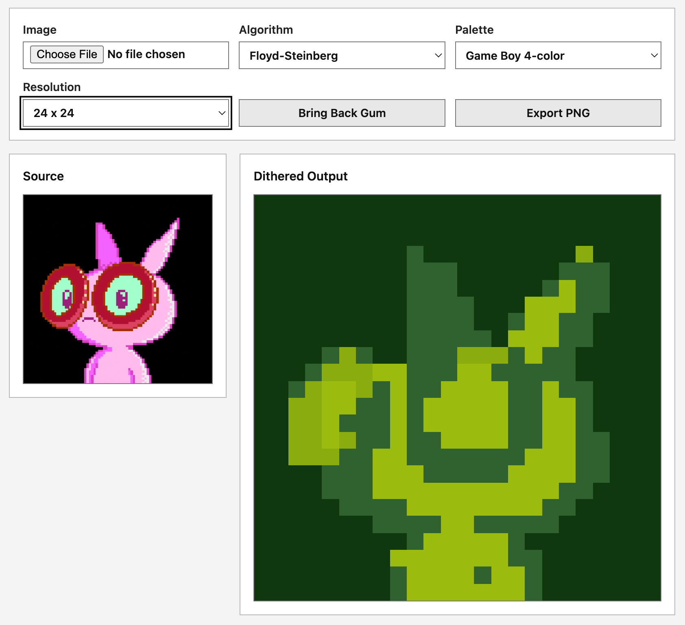
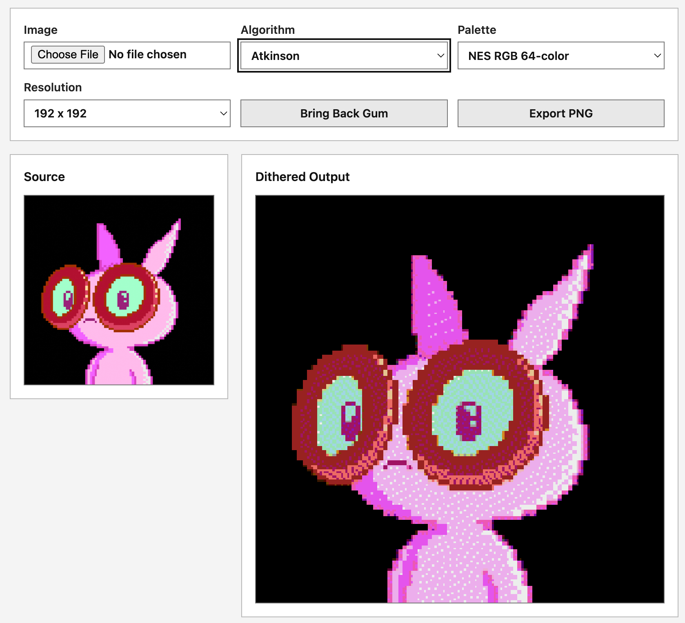

# ChewGum Dithering Gun

A small browser microscope for putting art under resolution, palette, and
dithering constraints.

Version 0.0.1.

## What This Is

ChewGum Dithering Gun lets you drop an image into the browser, reduce it to a
fixed square resolution, apply a palette, choose a dithering rule, and export a
PNG snapshot.

The first version is intentionally small. The goal is not to claim true
hardware emulation. The goal is to make the tradeoff visible:

> Resolution decides how many image decisions must be made. Palette size
> decides how many color choices each decision can compare against.

This repo was extracted from the Dithering Heights toy:

https://shanecurry.com/lab/toys/dithering-heights/

## Example Output

The same source image can remain recognizable or break apart depending on the
resolution, palette, and dithering rule.

| 24 x 24, Floyd-Steinberg, Game Boy | 192 x 192, Atkinson, NES RGB |
| --- | --- |
|  |  |

## Install

This is dependency-free ESM with no build step. The first public install path is
GitHub:

```sh
npm install github:chewgumlabs/ChewGumDitheringGun
```

You can also clone the repo or copy `src/` directly. The package name is already
reserved in the project metadata for a later npm release, but v0.0.1 is meant to
prove the small browser tool first.

## Run The Browser Microscope

From the repo root:

```sh
npm run dev
```

Then open:

http://localhost:5174/examples/browser-microscope/

Drop a `png`, `jpg`, or `webp` image into the page. The image stays in your
browser. There is no upload behavior.

## Module Shape

- `src/dither.js` - nearest-color, ordered Bayer, Floyd-Steinberg, and
  Atkinson dithering over `ImageData`-shaped objects.
- `src/palettes.js` - small named palettes, including monochrome, Game Boy,
  NES RGB 64-color, and RGB cube 216-color.
- `src/canvas.js` - browser helpers for sampling an image/canvas into a square
  source and drawing pixelated output.

Basic usage:

```js
import {
  ditherImageData,
  getPalette,
} from '@chewgum/dithering-gun';

const imageData = context.getImageData(0, 0, 96, 96);
const palette = getPalette('nes');

ditherImageData(imageData, {
  algorithm: 'ordered-bayer-4',
  palette,
  inPlace: true,
});

context.putImageData(imageData, 0, 0);
```

## Browser Example Features

- Drag/drop or file-picker image input.
- Included Gum demo image that loads on page open.
- Resolution presets: 24, 48, 96, 144, 192, and 256.
- Palette presets: 1-bit monochrome, Game Boy 4-color, NES RGB 64-color, and
  RGB cube 216-color.
- Dither presets: nearest color, ordered Bayer, Floyd-Steinberg, and Atkinson.
- PNG snapshot export.

## 3D Source Plan

Version 0.0.1 does not load 3D model files directly. The intended contract is
source-agnostic:

1. Render any source to a canvas: image, sprite, video frame, WebGL scene, or
   3D model viewer.
2. Sample that canvas down to a square resolution.
3. Run the sampled `ImageData` through the dithering gun.
4. Export the interpreted result.

That means a future Three.js or ViewMaster adapter can feed this same core
without changing the dithering math.

## What Is Not In v0.0.1

- No upload service.
- No storage.
- No model-file parser.
- No claim of exact console hardware emulation.
- No framework wrapper.

## Verification

```sh
npm test
```

## License

Code is MIT. Attributed to Shane Curry / ChewGum Labs.

Demo character assets are not automatically covered by the code license. See
`examples/assets/README.md`.
